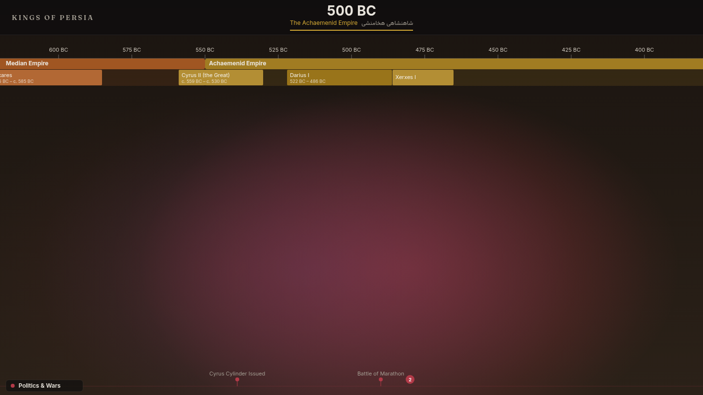

# Kings of Persia

An interactive, horizontally-scrollable timeline of **2,700 years of Iranian
history** — from the Median Empire (728 BC) to the fall of the Pahlavi dynasty
(1979). Scrolling pans through time; zooming changes the time scale and
progressively reveals detail. Dynasties and their kings render as nested bars,
major events as markers in category lanes, and the whole page changes
atmosphere by era as you move through it.


<!-- TODO: record docs/media/hero.png (or hero.gif) and commit it here. -->

## Highlights

- **Scroll / pan / zoom timeline** — native horizontal scroll with momentum,
  cursor-anchored zoom (ctrl/pinch-wheel), drag-to-pan, and full keyboard nav.
- **Era atmosphere** — a full-viewport background that crossfades between 12
  era palettes (Achaemenid golds → Sasanian crimson → Safavid greens →
  Pahlavi navy…) as the centered year moves.
- **Level-of-detail rendering** — zoomed out shows clean dynasty bars; zooming
  in reveals individual king reign segments, then their names and dates.
- **Bilingual (EN / FA)** — every name/title carries its Persian form,
  rendered right-to-left in the Vazirmatn typeface.
- **Virtualized SVG** — only elements intersecting the viewport mount, so the
  full 2,700-year span stays smooth.
- **Shareable URLs** — the current year, zoom, and open panel are written to
  the URL; opening that link restores the exact view.
- **Accessible** — keyboard-operable timeline, focusable/labeled elements,
  visible focus rings, and `prefers-reduced-motion` support throughout.

## Tech stack

- **React 19** + **TypeScript** (strict, no `any`)
- **Vite 8** build/dev
- **Jotai** for state (viewport + selection atoms)
- **SVG** for all timeline rendering
- **Vitest** for unit tests
- Self-hosted variable fonts (Fraunces / Inter / Vazirmatn via `@fontsource`)

## Architecture

The timeline maps **years → x-pixels** linearly; that mapping is the spine of
the app and always goes through `src/utils/coords.ts`.

```
viewport atoms                derived atoms                 components
──────────────                ─────────────                 ──────────
ppsAtom (zoom)        ┐
scrollXAtom           ├─►  visibleRangeAtom  ──►  Timeline / Events (virtualized)
viewportWidthAtom     ┘    centerYearAtom    ──►  HeaderHUD
                           currentEraAtom    ──►  EraBackground
selectionAtom         ─────────────────────►     DetailPanel
```

- `useTimelineViewport` owns all scroll/wheel/drag/keyboard wiring and the
  URL read/write, and exposes a `zoomToYear` action via `ViewportContext`.
- Pure, tested helpers live in `src/utils/` (`coords`, `format`, `color`,
  `cluster`, `ticks`, `urlState`, `geo`) and `src/data/eras.ts`.
- Visual style is centralized in `src/theme/tokens.ts`; timeline **geometry**
  constants stay in `src/utils/constants.ts`.

The detailed build plan lives in [`docs/plan/`](docs/plan/).

## Getting started

```bash
npm install
npm run dev       # Vite dev server
npm run build     # tsc -b && vite build
npm run preview   # preview the production build
npm run test      # Vitest unit suite
npm run lint      # ESLint
```

## Controls

| Action | Input |
|---|---|
| Pan through time | drag, mouse wheel, trackpad two-finger swipe, scrollbar |
| Zoom | ctrl/⌘ + wheel, pinch, or `+` / `-` |
| Jump to start / end | `Home` / `End` |
| Pan by keyboard | `←` / `→` (hold `Shift` for larger steps) |
| Open details | click (or focus + `Enter`/`Space`) a dynasty, king, or event |
| Close panel | `Esc` or click outside |
